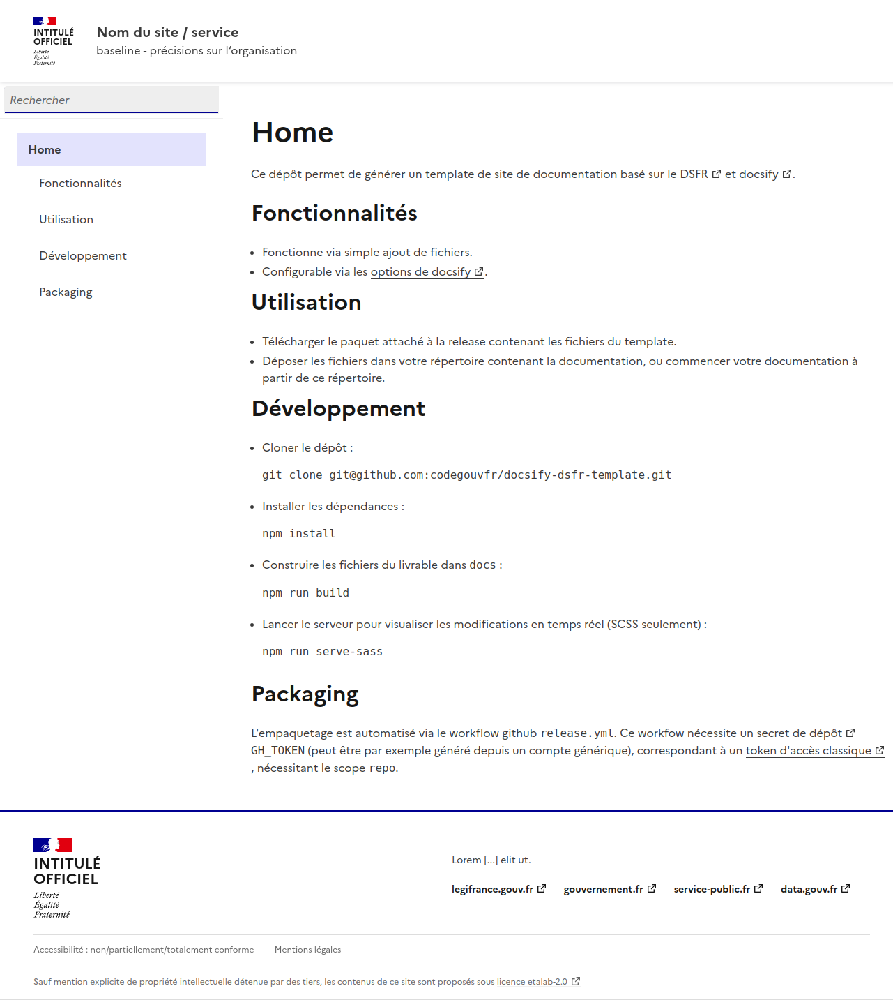

Ce dépôt permet de générer un template de site de documentation basé sur le [DSFR](https://www.systeme-de-design.gouv.fr/) et [docsify](https://github.com/docsifyjs/docsify).



## Fonctionnalités

- Fonctionne via simple ajout de fichiers.
- Configurable via les [options de docsify](https://docsify.js.org/#/configuration).

## Utilisation

- Télécharger le paquet attaché à la release contenant les fichiers du template.
- Déposer les fichiers dans votre répertoire contenant la documentation, ou commencer votre documentation à partir de ce répertoire.

## Développement

- Cloner le dépôt :
```
git clone git@github.com:codegouvfr/docsify-dsfr-template.git
```
- Installer les dépendances :
```
npm install
```
- Construire les fichiers du livrable dans [`docs`](docs) :
```
npm run build
```
- Lancer le serveur pour visualiser les modifications en temps réel (SCSS seulement) :
```
npm run serve-sass
```

## Packaging

L'empaquetage est automatisé via le workflow github [`release.yml`](.github/workflows/release.yml).
Ce workfow nécessite un [secret de dépôt](https://docs.github.com/fr/actions/security-guides/using-secrets-in-github-actions#creating-secrets-for-a-repository) `GH_TOKEN` (peut être par exemple généré depuis un compte générique qui a un accès en écriture au dépôt), correspondant à un [token d'accès classique](https://docs.github.com/fr/authentication/keeping-your-account-and-data-secure/managing-your-personal-access-tokens#cr%C3%A9ation-dun-personal-access-token-classic), nécessitant le scope `repo`.